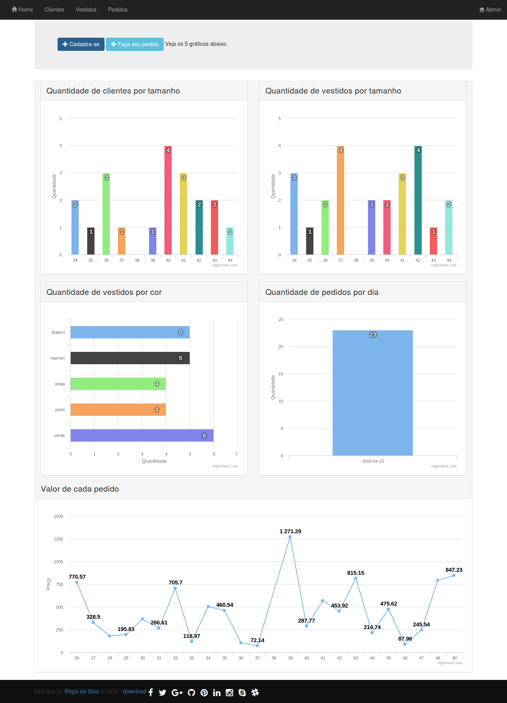

# dg-challenge


## Objetivo

Nós somos a primeira plataforma online para aluguel de vestidos de grandes estilistas do país.
Nossos principais produtos são vestidos e acessórios femininos.

Considere que os nossos vestidos têm como principais características seu modelo, estilista, cor, altura e tamanho.

Quando uma cliente faz uma locação precisamos saber seu nome, endereço, cidade, estado, cep, telefone celular, altura, busto, quadril, cintura, salto e tamanho que ela usa.

Baseado nessas informações, seu desafio é estruturar:

* A base de dados
* A interface gráfica para administrar esses dados
* Criar uma API REST para fazermos o CRUD de vestidos e clientes
* Devemos poder atribuir vestidos a clientes tanto pela interface quanto pela API

Plus:

* Gostamos de gráficos
* Gostamos de coisas customizadas, fora do default
* Gostamos de Python e Django


## Instalação

* Clone o repositório.
* Crie um virtualenv com Python 3.5
* Ative o virtualenv.
* Instale as dependências.
* Configure a instância com o .env
* Rode a migração
* Crie um usuário username='admin' pass='demodemo'

```
git clone https://github.com/rg3915/dg-challenge.git
cd dg-challenge
python -m venv .venv
source .venv/bin/activate
PS1="(`basename \"$VIRTUAL_ENV\"`):/\W$ " # opcional
pip install -r requirements.txt
cp contrib/env-sample .env
./manage.py makemigrations core
./manage.py migrate
./manage.py createsuperuser --username='admin' --email=''
make shell_customer
make shell_dress
make shell_order
```

Você também pode usar o **Selenium** para preencher os formulários. Para isso você vai precisar de **duas abas do terminal**.

* Em uma você roda a app na porta 8000
* E na outra você roda os comandos a seguir:

```
make selenium_customer
make selenium_dress
```

O **pedido** é feito manualmente a partir de [http://localhost:8000/order/add/](http://localhost:8000/order/add/) .

## Screenshot

